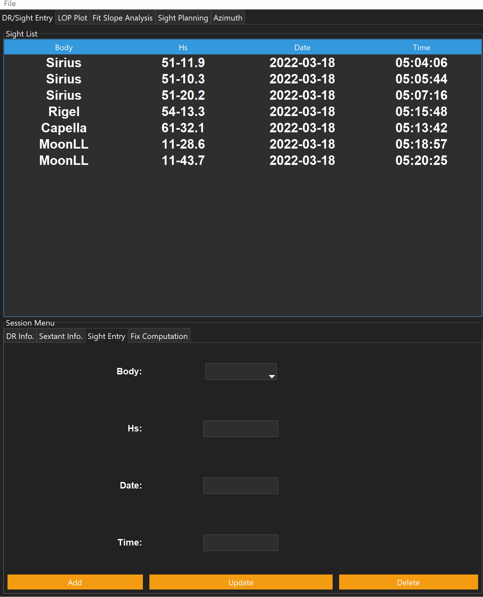
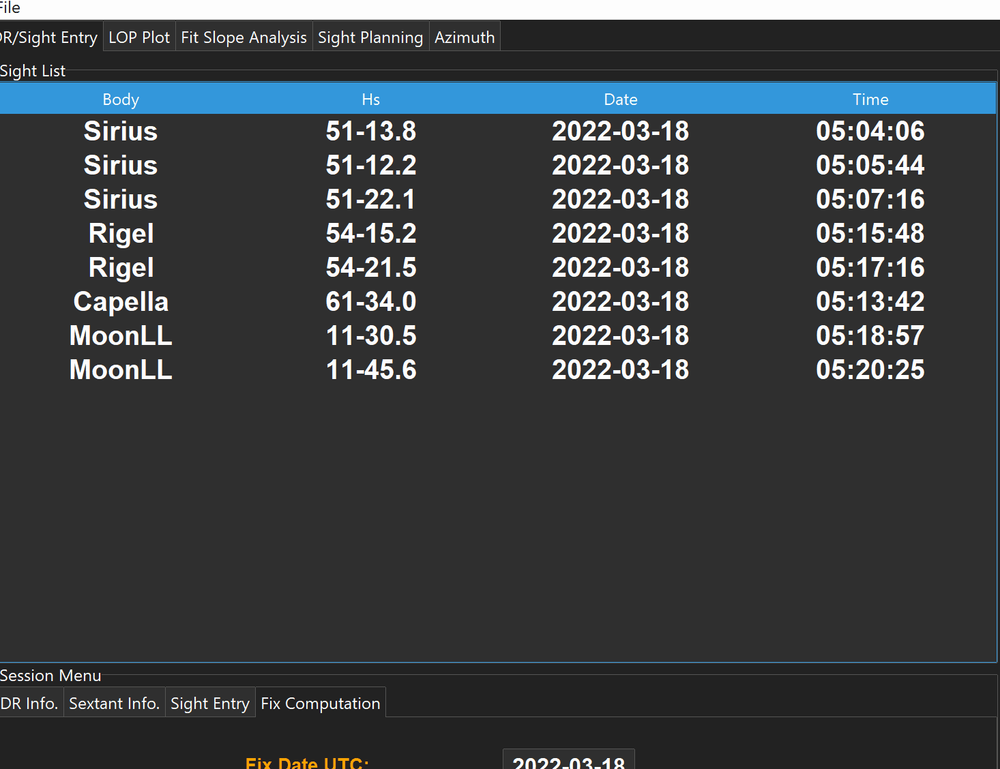
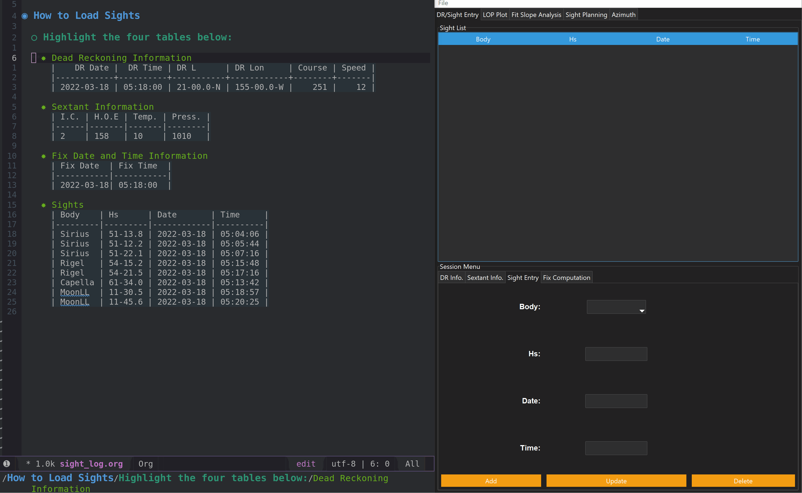
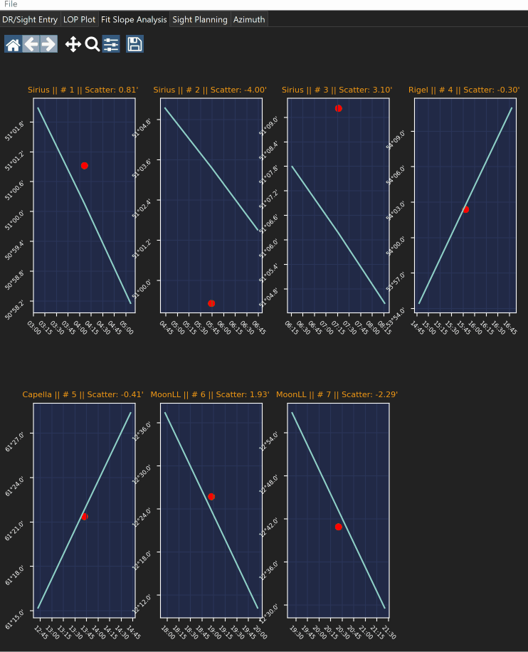
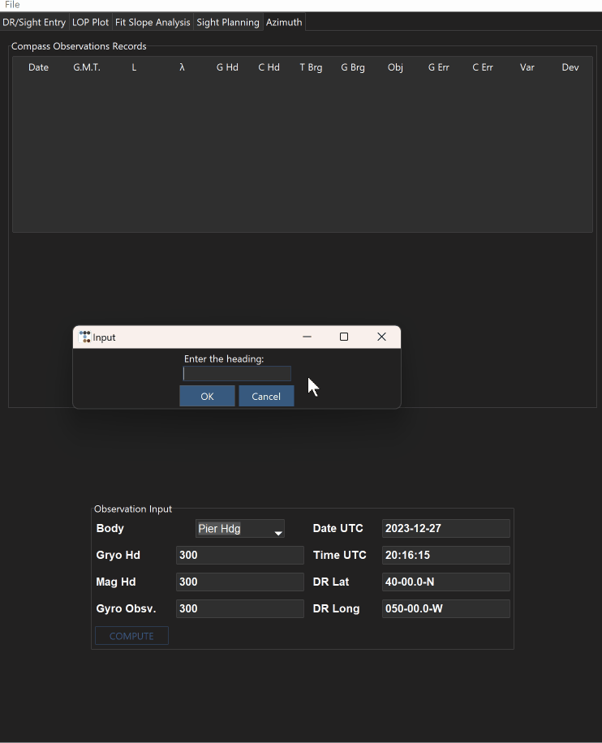

# Capella
---


# Introduction

Capella is a simple-to-use Astronavigation aid. The program will derive a celestial position fix from a minimum of inputs and plot the position on a chartlet, with an analysis of the accuracy of computed position provided. The program  additionally features some helper functions for celestial observation session planning, DR computation and compass correction. 

Traditional celestial navigation methods are lengthy, error prone, and require the navigator to have an accurate dead reckoning position as well as accurate course and speed information in order to yield a reasonable fix. Capella endeavors to leverage powerful, modern, machine learning methods in order to yield an accurate position fix from noisy, missing or possibly even erroneous information. 

This manual is not a how-to on celestial navigation, and knowledge of the subject as well as an understanding of the basic tenants of seamanship and navigation is assumed. The intended user of this program is a proficient mariner who aspires to incorporate celestial navigation into their daily practice, but has felt that the here-to-fore cumbersome nature of the sight reduction process has stopped them from doing so.

# Section 1: Sight Entry

**DR Information**

All effective navigation starts with keeping an accurate dead reckoned position (DR). While Capella's sight reduction algorithm should yield an accurate position fix from sight inputs using an inaccurate DR position, the navigator should *never* abuse this. For the program to work effectively, first provide a DR position, time, course and speed. 

Capella uses the standard nautical conventions for time and position formatting, and all times are kept in UTC. Capella will format the input for you---just type in the numbers for the respective field and when you are finished press tab or click to advance to the next input field. If erroneous information has been inputted, the field will flag with the color RED. 


**Sextant Information**

This is where standard pre-sight information regarding your sextant and environmental factors goes. Index error is entered in arc minutes as a positive or negative value, using the "off is on, and on is off" convention, i.e. if your error is on the arc, enter it as a negative value. 


**Sight Entry**

In the Step 2 section, complete the four required fields. All of the input fields will assist with autocompletion and formatting. The fields are: **1. Body 2. Hs Value 3. Sight Date 4. Sight Time**. 
All sextant altitude corrections are handled internally, simply input the Hs value for the observation.

When you have completed the four input fields, hit the *Add* button and the sight will appear in the Sight List at the top of the screen. To edit previously entered information, click on the sight in the *Sight List*, the sight's information will populate the sight entry fields under Step 2. Make any required changes and hit *Update* and the sight entry will change in the *Sight List*. To remove a sight from the *Sight List*, simply click on the sight and hit *Delete*. Multiple sight handling is easily achieved using the conventional Shift or Ctrl + click features. 

*Sight Averaging*




If you have multiple observations of the same body, you can CTRL or SHIFT click on them in the Sight Entry area, and the average of their Hs and time/date values will appear in the Sight Info Area. Press the *Add* button to add the averaged sight. It is recommended you first compute the position with all sights unaveraged and use the *Fit-Slope Analysis* feature to find which values should be eschewed or kept for averaging.

*Almanac Computation*

Capella features a high-accuracy perpetual almanac valid from the years 1900-2050, with the data taken from the JPL de421 database. Once the fix is computed, all almanac data is displayed in the *Sight Data/Planning* section. 

**Fix Computation**

Capella will calculate a fix from the DR information provided in the DR Info section and the sights added to the Sight List. A fix can be calculated from just one sight and the provided DR information, however the algorithm needs at least 2 sights to provide a more accurate fix. Once two or more sights are present in the *Sight* field and a *Fix Time* and *Fix Date* has been provided, hit the *Compute Fix* button or press *CTRL-l*. Capella will calculate a running fix based on the DR and *Fix Time* information provided. The calculated results as well as a DR position for the requested *Fix Time* will appear highlighted at the bottom. 

The position calculation is provided by a global genetic optimization algorithm: Storn and Price's Differential Evolution algorithm. This algorithm is robust with respect to erroneous DR information, will not converge to a local minimum and can effectively handle high altitude sights.

*Example 1:*

The Sight Information below yields the fix: **40-14.0-N, 049-58.0-W**.

### 1. Dead Reckoning Information
| DR Date   | DR Time  | DR L      | DR λ       | Course | Speed |
| --------- | -------- | --------- | ---------- | ------ | ----- |
| 1993-5-13 | 07:30:00 | 40-10.0-N | 050-15.0-W | 090    | 5.5   |

### 2. Sextant Information Information
| I.C. | H.O.E | Temp. | Press. |
| ---- | ----- | ----- | ------ |
| -1.2 | 7     | 10    | 1010   |

### 3. Fix Date and Time Information
| Fix Date   | Fix Time |
| ---------- | -------- |
| 1993-05-13 | 07:44:00 |

### 4. Sights
| Body       | Hs      | Date       | Time     |
| ---------- | ------- | ---------- | -------- |
| Kochab     | 43-23.8 | 1993-05-13 | 07:33:45 |
| Rasalhague | 51-05.2 | 1993-05-13 | 07:35:16 |
| Alkaid     | 30-15.9 | 1993-05-13 | 07:37:15 |
| Altair     | 58-38.0 | 1993-05-13 | 07:39:02 |
| Venus      | 15-15.3 | 1993-05-13 | 07:41:24 |
| MoonLL     | 34-05.6 | 1993-05-13 | 07:44:08 |

## Error Handling



**DR Error**

By changing the DR Position to 00-00.0-N and 000-00.0-W *--a position 3673 nm away--* and keeping the same observation data, Capella yields the fix: **40-14.3-N, 049-57.8-W**. 

By changing the DR position to the McMurdo Ice Station, located at 77-51.0-S, 166-40.1-E *-- a position 8368 nm away and in different hemispheres--* and keeping the same observation data, Capella yields the fix: **40-14.3-N, 049-59.3-W**. 

**Erroneous Sights**

Bad sights will happen in a seaway. Capella uses a statistical model to evaluate the quality of your sights. If a sight seems to be a blunder, Capella will highlight the sight in red and present a pop-up dialog asking if you would like to remove the sight. 

**Systematic Error**

If Capella's systematic error algorithm detects uncorrected index and personal error, a prompt will appear asking you could like to remove the error from your observations and recompute the fix. Click *Ok* and the fixed position will be re-computed and displayed. This process can be iterative and the prompt might appear multiple times, with each cycle bringing the calculated fix closer to the observer's true position. This method isn't a magic bullet, but can yield impressive results in certain circumstances. 

## Loading and Saving Observations





Capella uses the computer's clipboard as a means of loading and saving observations. Rather than saving the observations in a proprietary format, the observations are copied to the clipboard in simple rich text tables that can be pasted into any .txt file the navigator wishes to use as a sight log. 

*To Save Sights*
1. In Capella, click File-Save Sights to Clipboard or CTRL-s. 
2. 4 markdown format tables will be saved to your computer's clipboard.
3. Paste them in any .txt file you would like to use as a log. 

*To Load Sights*
1. Highlight the the 4 tables that you pasted into the .txt file of choice. 
2. Copy to the computer's clipboard via CTRL-C or using the mouse.
3. In Capella, click File-Load Sights from Clipboard or CTRL-l


*Why do it like this?*
1. Simplicity. You can use one E-log for record keeping, note taking and to interact with the program. Your observations are saved as rich text and you own them forever.
2. Using the your operating system's window management features allows you to snap Capella to one side of the screen and snap the `.txt` sight log of choice to the other. Using the `ctrl` quick keys you can rapidly edit the observations in the `.txt` log and compute the observations in Capella side by side. 
3. Most celestial navigation programs have UI issues that are difficult and frustrating to navigate, using this method, you can use any familiar text editor as the primary controller of the program. Simply use the below template (Note: Just save an empty sight session on startup to get the template):

```
### 1. Dead Reckoning Information

| DR Date    | DR Time  | DR L        | DR Lon.      | Course | Speed |
| ---------- | -------- | ----------- | ------------ | ------ | ----- |
| yyyy-mm-dd | hh:mm:ss | dd-mm.t-N/S | ddd-mm.t-E/W | ddd    | d.t   |


### 2. Sextant Information Information

| I.C. | H.O.E | Temp. | Press. |
| ---- | ----- | ----- | ------ |
| d.t  | d     | 10    | 1010   |

### 3. Fix Date and Time Information

| Fix Date   | Fix Time |
| ---------- | -------- |
| yyyy-mm-dd | hh:mm:ss |

### 4. Sights

| Body | Hs      | Date       | Time     |
| ---- | ------- | ---------- | -------- |
| Body | dd-mm.t | yyyy-mm-dd | hh:mm:ss |
| ...  | ...     | ...        | ...      |
```
# Section 2: LOP Plot


**Exploring the plot**

Once the fix is computed from the *Sight Entry* page, the LOP's for the observations are automatically plotted. The plot is highly customizable with respect to  size, aspect and zoom via the buttons located in the lower right corner. Click the *NSEW arrow* icon and then left-click and drag on the plot to move the plot, the Latitude and Longitude scales will automatically change. A right-click and drag will change the plots aspect. To reset the plot back to the default at any time, click on the *House* icon. To zoom in on the plot, click the *Magnifying Glass* icon and then left-click and drag to zoom-in and right-click and drag to zoom-out. 

Wherever the mouse travels in the plot area, the Lat/Long position will appear in the lower right corner. To save the plot as a PNG image, select the *Floppy Disk* image in the lower right corner.

**Plot Information**

The LOPS are automatically advanced with the course and speed information provided in the *Sight Entry* section and bodies are labeled on the plot and in the sight key area. Additionally, the computed DR position for the *Fix Time* is also plotted. If the DR is very far from the LOP plot, the plot will need to be zoomed for a better aspect, however, if a good DR is being kept, this should not be necessary in most cases. 


# Section 3: Fit Slope Analysis



This is an implementation of Dr. David Burch's Fit Slope method. It is a means of deriving greater accuracy from our sight observations and attempting to spot any outliers or potential blunders. 

**How  Fit-Slope Analysis works**

The vessel is moving all the time at sea and and the celestial objects are moving all the time as well. If we take 3 observations of the Sun, how do we know which observations were accurate and which weren't? 

A simple averaging of the sights and times may not yield more accurate results if one of the observations is erroneous--However, the ascending or descending slope of the body can be computed and plotted as a function of time and estimated position, and the slope will be mostly linear as long as the timescale is fairly short.

We can then plot our observation relative to this line defined by the slope. If our observation is way off of the slope, the sight is likely a blunder, if it is close to the slope it was likely O.K. With multiple observations this allows us to find any outliers. Using the 3 Sun observation example, if 2 observations scatter close to the fitted slope and another scatters way off of the slope, we know we can discard that observation as it was likely a blunder. If all three observations scatter within 1 or 2 arc minutes of the fitted slope, we can safely average the sights to reduce the amount of error in our observations. 

**Plot Information**
 
Each plot on the *Fit-Slope* page has a fitted *slope* and a *red dot*. The *slope* represents the computed altitude at the DR Position one minute behind the DR position of the observation and the computed altitude at the DR position one minute ahead of the DR position of the observation. A red dot is the observed altitude at the time of the observation. With this information you can see if your observation was under-observed or over-observed. the *Scatter* value at the top of each plot tells you how by how many minutes of arc your observation was over or under the computed slope.  The X-axis scale is minutes after the hour of observation, and covers a 2 minute timescale. The Y-axis scale is the computed range of altitudes for the observed body over that 2 minute scale. As with the LOP Plot page, every plot is fully interactive and explorable using the buttons in the lower left corner, and the values for any point on the plot will appear in the lower right corner.

*Example 2:*

The following observations are taken and a fix of 21-11.0-N, 157-34.7-W is computed, the observer's actual position is: 21-12.0-N, 157-30.0-W. 

The fit slope analysis shows that the Aldebaran observation at 03:07:00 scatters 9.79 arc minutes under the computed slope while the other Aldebaran observations are + 0.64' and + 1.74' respectively. This observation is clearly a blunder, and the LOP plot confirms that it is far away from our other LOPS so it is removed altogether from the *Sight List* and a new position is computed: 


### 1. Dead Reckoning Information
| DR Date    | DR Time   | DR L      | DR λ       | Course | Speed |
|------------|-----------|-----------|------------|--------|-------|
| 1990-01-02 | 03:00:00  | 21-12.0-N | 157-30.0-W | 0      | 0     |

### 2. Sextant Information
| I.C. | H.O.E | Temp. | Press. |
|------|-------|-------|--------|
| 0    | 0     | 10    | 1010   |

### 3. Fix Date and Time Information
| Fix Date   | Fix Time   |
|------------|------------|
| 1990-01-02 | 03:12:00   |

### 4. Sights
| Body      | Hs      | Date       | Time     |
|-----------|---------|------------|----------|
| Deneb     | 50-15.0 | 1990-01-02 | 03:00:00 |
| Fomalhaut | 38-54.0 | 1990-01-02 | 03:01:00 |
| Aldebaran | 15-32.0 | 1990-01-02 | 03:02:00 |
| Deneb     | 49-27.0 | 1990-01-02 | 03:05:00 |
| Fomalhaut | 38-46.0 | 1990-01-02 | 03:06:00 |
| Aldebaran | 16-30.0 | 1990-01-02 | 03:07:00 |
| Deneb     | 48-38.0 | 1990-01-02 | 03:10:00 |
| Fomalhaut | 38-37.0 | 1990-01-02 | 03:11:00 |
| Aldebaran | 17-50.0 | 1990-01-02 | 03:12:00 |

The fit slope analysis shows that the Aldebaran observation at 03:07:00 scatters 9.79 arc minutes under the computed slope while the other Aldebaran observations are + 0.64' and + 1.74' respectively. This observation is clearly a blunder, and the LOP plot confirms that it is far away from our other LOPS so it is removed altogether from the *Sight List* and a new position is computed: 
21-12.0-N, 157-31.5-W. The position can be further refined, by either selecting the individual sights with the least scatter, or averaging each set since the Fit-Slope analysis confirms their normal distribution, both methods will yield a fix with a similar level of accuracy. 

# Section 4: Planning/Session Data

**Sight Planning** 


The *Sight Planning* utility provides a quick and convenient means of plotting a round of observations prior to a sight session.

To use:

1. Ensure the green labeled field on the first page are filled. 
2. Click the plan button. A list of major celestial phenomena for a 24 hour period is displayed in the *Phenomena* field below. All the times are corrected with a "second estimate" based on the DR information provided.
3. Select a time of phenomena and click the *Plan* button. The *Visible Bodies* and *Optimal Triads* fields will populate with the relevant information.

*Visible Bodies*

A list of all celestial bodies that are visible at the specified time and computed DR position that are between 25 and 65 degrees in altitude. Their altitude, azimuth and magnitude are calculated for the specified time and calculated DR position and listed in a scrollable table. 

*Optimal Triads*

A weighting algorithm will list optimal groupings of 3 celestial objects based on azimuthal distribution, magnitude and altitude and list them in a scrollable table.

*Example 3:*

it is 2012-07-06 at 09:00:00 UTC and we wish to plan for the day's observations. We input the below information in the *Sight Entry* DR fields. 


### 1. DR Information
| DR Date    | DR Time  | DR L      | DR λ       | Course | Speed |
| ---------- | -------- | --------- | ---------- | ------ | ----- |
| 2012-07-06 | 09:00:00 | 48-18.4-N | 006-26.5-W | 208    | 17    |

We enter the 2012-07-06, 09:00:00 UTC in the input fields in the Planning Controls tab and hit *Set Time*. We click on the time of phenomena tab and see that L.A.N. will occur at 12:33:21 UTC. and PM Nautical Twilight will be around 21:00:00 UTC. 

At 12:30:00 UTC we begin a round of noon sights:

| Body   | Hs      | Date       | Time     |
|--------|---------|------------|----------|
| SunLL  | 65-03.4 | 2012-07-06 | 12:29:22 |
| SunLL  | 65-05.3 | 2012-07-06 | 12:33:22 |
| SunLL  | 65-05.4 | 2012-07-06 | 12:34:22 |
| SunLL  | 65-05.6 | 2012-07-06 | 12:35:22 |
| SunLL  | 65-05.6 | 2012-07-06 | 12:36:22 |
| SunLL  | 65-05.6 | 2012-07-06 | 12:37:22 |
| SunLL  | 65-05.4 | 2012-07-06 | 12:38:22 |

The *Fit Slope Analysis* tab confirms that our 12:33:22 observation was the meridian transit, agreeing with the computed 12:33:21 estimate. Our 12:33:00 computed Latitude at LAN is therefore 47-24.7- N, and the GHA of our LAN observation is 007-08.1 - this is listed in the *Sight Data* table. Our computed position is therefore 47-24.7-N, 007-08.1-W. 

We enter our fix as our new DR on the *Sight Entry* page and enter 21:00:00 UTC - the approximate time of Nautical Twilight we computed earlier - in the time field under *Planning Controls*. Our 21:00:00 UTC DR position updates to 45-18.3-N, 008-46.0-W. Under *Body List* we see all of the optimal bodies to shoot for 21:00:00 UTC Star Time, calculated for DR position 45-18.3-N, 008-46.0-W. Under *Optimal Triads* we see the best 3-body groupings listed in order, weighted by azimuthal distribution, altitude and magnitude. 

Our plan is preset our sextant with the below listed values and try to get at least 3 observations of each body, weather permitting. 

*Optimal Triad 1*

| Body          | Alt     | Az  | Mag  |
| ------------- | ------- | --- | ---- |
| Alioth        | 64-10.1 | 308 | 1.76 |
| Zubenelgenubi | 28-06.5 | 189 | 2.75 |
| Deneb         | 36-51.7 | 60  | 1.25 |

# Section 5: Azimuth


**Observation Input**

In the *Observation Input* section, fill in the required input fields with the body observed, the gyro and magnetic heading, the gyro bearing, and time and position of the observation. As with all other fields of their type in the program, autocompletion and format checking are provided to assist the navigator. 

**Pier Heading**

If you intend to use a pier heading rather than a celestial observation, select pier heading from the *Body* field and input the pier heading into the input box. 

**Output** 

The output is provided in the *Compass Observations Records* field in the exact format used in the usual *Compass Observation Book* required by IMO standards. The Gyro Error, Compass Error, and Magnetic Variation and Magnetic Deviation are calculated. Magnetic Variation can be calculated for any position in the world and uses the World Magnetic Model Epoch 2020. The list of gaussian coefficients is internal to the program and is valid through 2025. 


